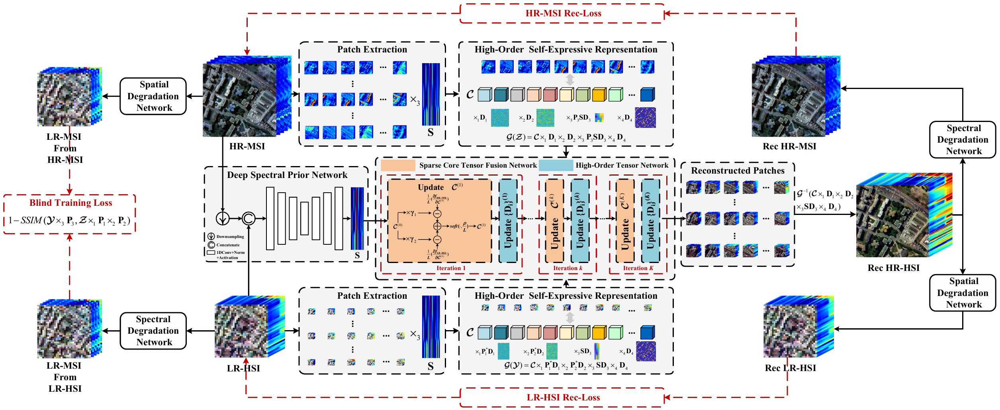

# Self-Expressive High-Order Tensor Unrolling Network for Unsupervised Hyperspectral and Multispectral Image Fusion

He Wang, Yang Xu\*, Zhihui Wei, Zebin Wu

Code for the paper: [Self-Expressive High-Order Tensor Unrolling Network for Unsupervised Hyperspectral and Multispectral Image Fusion](https://ieeexplore.ieee.org/document/11536824)-*TIP* 2026

<div align="center">

</div>

## Code Running 
Simple run `./unfolded_net_sparse_representation_full_unfolded.py` (non-local version is `./unfolded_net_sparse_representation_full_unfolded_nonlocal.py`) demo to implement the fusion of low-resolution hyperspectral image (LR-HSI) and high-resolution multispectral image (HR-MSI) of Sandiego. (Using [PyTorch](https://pytorch.org/) with `Python 3.7` implemented on `Windows` OS or `Linux` OS)

- Before: For the required packages, please refer to detailed `.py` files.
- Results: Please see the four evaluation metrics (PSNR, SAM, ERGAS, and UIQI) and the output `.mat` files saved in `./data/`.

:exclamation: You may need to manually simulate the two HSIs to your local in the folder under path `./data/pavia/`. The file path could be set in `./utils.py`. The simulation code implemented via MATLAB could be found in [DTDNML](https://github.com/Shawn-H-Wang/DTDNML).

## References
If you find this code helpful, please kindly cite:

[1] He, Wang and Yang, Xu and Zhihui, Wei and Zebin, Wu. "Self-Expressive High-Order Tensor Unrolling Network for Unsupervised Hyperspectral and Multispectral Image Fusion" in *IEEE Transactions on Image Processing*, vol. 35, pp. 5714-5729, 2026, doi: 10.1109/TIP.2026.3695389.


## Citation Details
```
@ARTICLE{10705122,
  author={Wang, He and Xu, Yang and Wei, Zhihui and Wu, Zebin},
  journal={IEEE Transactions on Image Processing}, 
  title={Self-Expressive High-Order Tensor Unrolling Network for Unsupervised Hyperspectral and Multispectral Image Fusion}, 
  year={2026},
  volume={35},
  number={},
  pages={5714-5729},
  keywords={Modeling;Tensors;Training;Matrices;Optimization;Learning (artificial intelligence);Superresolution;Hyperspectral imaging;PSNR;Heart rate;Hyperspectral image fusion;self-expressive learning;high-order tensor;deep unrolling network},
  doi={10.1109/TIP.2026.3695389}
}
```

## Licensing

Copyright (C) 2026 He Wang and Yang Xu

This program is free software: you can redistribute it and/or modify it under the terms of the GNU General Public License as published by the Free Software Foundation, version 3 of the License.

This program is distributed in the hope that it will be useful, but WITHOUT ANY WARRANTY; without even the implied warranty of MERCHANTABILITY or FITNESS FOR A PARTICULAR PURPOSE. See the GNU General Public License for more details.

You should have received a copy of the GNU General Public License along with this program.

## Contact

If you are interested in our work or encounter any bugs while using this code, please do not hesitate to contact us.

Sciencerely,

He Wang
<br>
School of Computer Science and Engineering
<br>
Nanjing University of Science and Technology
<br>
Email: he_wang@njust.edu.cn
